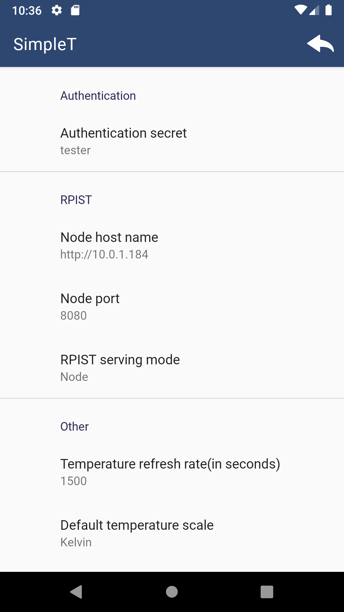

# SimpleT
Android 10+ interface for the RPIST microservice. View temperature readings produced by the
RPIST node and base station services. 

## **Activities**

### **Home Activity**
Depending on the selected mode, the home activity will either display a single node
or all of the nodes recorded by the base station.

  <kbd></kbd>
  <kbd></kbd>

Upon opening the app, the temperature scale will be the same one that was set in
settings. If none was set, then Celsius will be used. Still, it is possible to change the
scale on a node-per-node basis by clicking the specified node. The possible scales are
as follows: Fahrenheit, Celsius, and Kelvin. Each node displays the rpist id (as set in
RPIST) as well as the temperature. Temperature values are refreshed at the interval that was set in settings. *Note: base station values are psuedovalues as base station is currently a
planned feature.*

### **Settings Activity**
The settings activity allows the user to specifiy different preferences for the application. These allow for modifications of the scale, refresh, among other RPIST profiles.

  <kbd></kbd>

The list of all settings is as follows:
- **Authentication secret=** the secret, if any, that is used for authenticating with the
RPIST.
- **Node host name=** the host name of the RPIST. *Note: currently only HTTP is supported.* 
- **Node serving mode=** the port of the RPIST.
- **Temperature refresh rate=** the refresh rate of temperature readings.
- **Default temperature scale=** the default temperature scale of all nodes when opening
the app.

## **Battery Saving Features**
To avoid background drain, SimpleT is designed to stop all network communication with RPIST
once the app is not in the foreground.